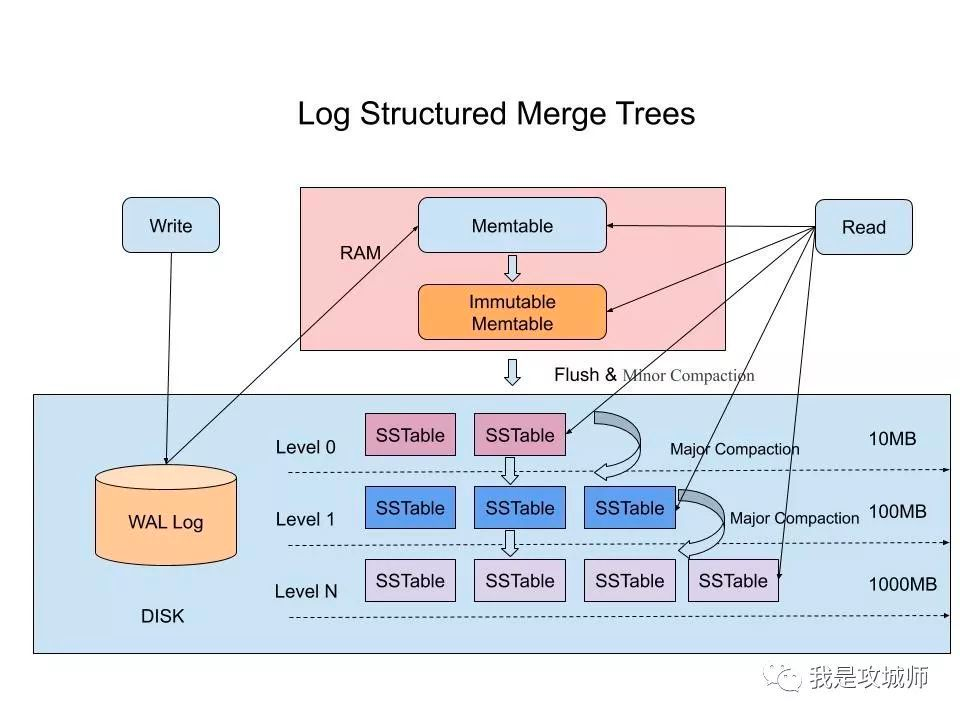

# LSM

# 为什么是LSM？

LSM-tree(Log-Structured Merged-tree) 现如今已经被广泛应用在了各个NoSQL存储系统中，
如BigTable, Dynamo, HBase, Cassandra, LevelDB, RocksDB 和 AsterixDB。
相比于传统的in-place updates(就地更新) 索引结构，LSM-tree 第一次写入都缓存到内存中，
并通过后台的flush来顺序追加到磁盘中，也就是out-of-palce updates。
LSM-tree这样的实现方式有非常多的优点，包括写性能的提升、简单的并发控制和异常恢复等。
这些优点使LSM树可以服务于多种场景，如Facebook开发的基于LSM-tree的存储引擎rocksdb，
被广泛应用在实时数据处理/图数据处理/流式数据处理以及OLTP(on line transaction processing)等多种workload。

*key point*

以日志存储数据

我们总结下在在LSM-Tree里面如何写数据的？

1，当收到一个写请求时，会先把该条数据记录在WAL Log里面，用作故障恢复。

2，当写完WAL Log后，会把该条数据写入内存的SSTable里面（删除是墓碑标记，更新是新记录一条的数据），也称Memtable。注意为了维持有序性在内存里面可以采用红黑树或者跳跃表相关的数据结构。

3，当Memtable超过一定的大小后，会在内存里面冻结，变成不可变的Memtable，同时为了不阻塞写操作需要新生成一个Memtable继续提供服务。

4，把内存里面不可变的Memtable给dump到到硬盘上的SSTable层中，此步骤也称为Minor Compaction，这里需要注意在L0层的SSTable是没有进行合并的，所以这里的key range在多个SSTable中可能会出现重叠，在层数大于0层之后的SSTable，不存在重叠key。

5，当每层的磁盘上的SSTable的体积超过一定的大小或者个数，也会周期的进行合并。此步骤也称为Major Compaction，这个阶段会真正 的清除掉被标记删除掉的数据以及多版本数据的合并，避免浪费空间，注意由于SSTable都是有序的，我们可以直接采用merge sort进行高效合并。

接着我们总结下在LSM-Tree里面如何读数据的？

1，当收到一个读请求的时候，会直接先在内存里面查询，如果查询到就返回。

2，如果没有查询到就会依次下沉，知道把所有的Level层查询一遍得到最终结果。

思考查询步骤，我们会发现如果SSTable的分层越多，那么最坏的情况下要把所有的分层扫描一遍，对于这种情况肯定是需要优化的，如何优化？在 Bigtable 论文中提出了几种方式：

1，压缩

SSTable 是可以启用压缩功能的，并且这种压缩不是将整个 SSTable 一起压缩，而是根据 locality 将数据分组，每个组分别压缩，这样的好处当读取数据的时候，我们不需要解压缩整个文件而是解压缩部分 Group 就可以读取。

2，缓存

因为SSTable在写入磁盘后，除了Compaction之外，是不会变化的，所以我可以将Scan的Block进行缓存，从而提高检索的效率

3，索引，Bloom filters

正常情况下，一个读操作是需要读取所有的 SSTable 将结果合并后返回的，但是对于某些 key 而言，有些 SSTable 是根本不包含对应数据的，因此，我们可以对每一个 SSTable 添加 Bloom Filter，因为布隆过滤器在判断一个SSTable不存在某个key的时候，那么就一定不会存在，利用这个特性可以减少不必要的磁盘扫描。

4，合并

这个在前面的写入流程中已经介绍过，通过定期合并瘦身， 可以有效的清除无效数据，缩短读取路径，提高磁盘利用空间。但Compaction操作是非常消耗CPU和磁盘IO的，尤其是在业务高峰期，如果发生了Major Compaction，则会降低整个系统的吞吐量，这也是一些NoSQL数据库，比如Hbase里面常常会禁用Major Compaction，并在凌晨业务低峰期进行合并的原因。

最后有的同学可能会问道，为什么LSM不直接顺序写入磁盘，而是需要在内存中缓冲一下？ 这个问题其实很容易解答，单条写的性能肯定没有批量写来的块，这个原理其实在Kafka里面也是一样的，虽然kafka给我们的感觉是写入后就落地，但其实并不是，本身是 可以根据条数或者时间比如200ms刷入磁盘一次，这样能大大提升写入效率。此外在LSM中，在磁盘缓冲的另一个好处是，针对新增的数据，可以直接查询返回，能够避免一定的IO操作。